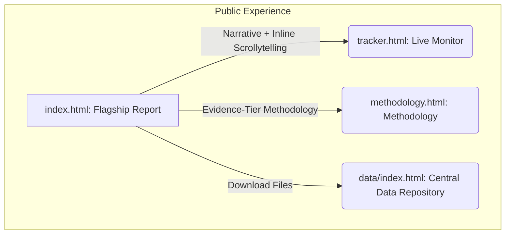

# Impunity Machine (BD-INV-002) — Publication Architecture Recommendation

**Author:** Publication Architecture Strategist  
**Date:** May 25, 2026  
**Status:** Recommended for review and human approval

---

## 1. Evaluation of Legacy Layout

The legacy *Impunity Machine* presentation is fragmented across five different URLs:
1.  `/investigations/national/impunity-machine/index.html` (Long-form narrative with simple charts)
2.  `/investigations/national/impunity-machine/visual.html` (Separate visual scrollytelling experience)
3.  `/investigations/national/impunity-machine/tracker.html` (Live tracker dashboard)
4.  `/series/impunity-machine/methodology.html` (Separate methodology document)
5.  `/series/impunity-machine/data.html` (Separate data download list)

This creates a high cognitive load for readers and weakens the visual journalism impact. The narrative and scrollytelling elements cover identical themes (Funnel Attrition, Section 17 Cox's Bazar case, DNA backlog, geographic OCC gaps) but are disconnected.

---

## 2. Recommended Final Publication Architecture

We recommend a **hybrid, visual-first visual journalism model** that unifies narrative depth with interactive scrollytelling inline.

### Key Decisions:
1.  **Flagship Report (`index.html`)**: Rebuild the main index page as the flagship visual experience. Integrate the scrollytelling visual blocks (Canvas-based funnel, two clocks, Section 17 visual comparison, backlog timelines, global race bars, and Leaflet division map) directly into the reading flow, surrounded by the high-resolution narrative text.
2.  **Live Tracker (`tracker.html`)**: Retain the tracker as a separate public-facing page under the investigation directory (`content/investigations/the-impunity-machine/tracker.html`). It serves as an active monitoring dashboard (displaying recent findings, the monthly ledger heatmap, and news feeds) to signal that the investigation is active.
3.  **Methodology (`methodology.html`)**: Relocate the methodology note to a clean, styled HTML page under `content/investigations/the-impunity-machine/methodology.html` to align with the website's design system (respecting the Lora typography for text and JetBrains Mono for formula logic).
4.  **Data Downloads (`data/index.html`)**: Move dataset downloads out of a separate impunity-machine data page and integrate them directly into the central website data repository (`/data/index.html`), while retaining direct download buttons inside the closing sections of the flagship report.
5.  **Navigation Cleanup**: Unify all headers and snav elements to link cleanly between these three main pages under the `/content/investigations/the-impunity-machine/` path.

---

## 3. Rationale for recommended option

*   **Story Flow**: Merging `index.html` and `visual.html` prevents story fragmentation. Readers experience the visual evidence (e.g. watching 10,000 dots disappear) at the exact moment the text explains the funnel numbers.
*   **Aesthetics**: Follows modern visual investigations standards (Reuters, NYT, Financial Times) where scrollytelling is the core report medium rather than an optional side page.
*   **Maintenance**: Consolidated files reduce script redundancy. Shared JS objects (such as theme toggles and maps) reside in the same folder.
*   **Mobile Presentation**: The hybrid model allows custom responsive CSS (e.g., pinning charts to the top of viewports on smaller screens while narrative cards scroll beneath them).
