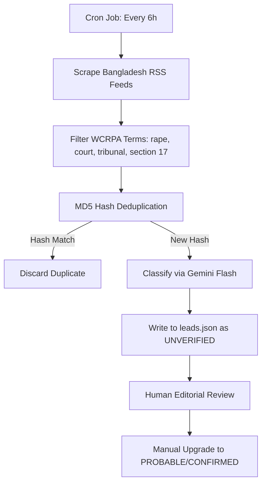

# Impunity Machine (BD-INV-002) — Data Audit & Codebook

This document outlines the data structures, schemas, collection pipelines, and reproducibility checks for the datasets used in the *Impunity Machine* investigation.

---

## 1. Master Evidence File Structure

The primary data store is [BD-INV-002_Master_Evidence_File.xlsx](file:///c:/Users/Administrator/Desktop/insightgaps.github.io-main/insightgaps.github.io-main/data/BD-INV-002_Master_Evidence_File.xlsx) (92,924 bytes), which contains the following worksheets:

1.  **`README`**: Details the license (CC BY-NC 4.0), contact email (`insightgaps@gmail.com`), version history, and sheet description mapping.
2.  **`AGGREGATE_STATISTICS`**: Annual rape case filings and VAW indicators (2001–2025) compiled from Police Headquarters (PHQ) and Bangladesh Mahila Parishad (BMP).
3.  **`CONVICTION_RATES`**: Monitors the 12 independent conviction rate studies (0.12% to 3.66%) with their specific denominators and sources.
4.  **`TRIBUNAL_CASES`**: Backlog metrics and operational tribunal counts (101 tribunals) across Bangladesh's divisions.
5.  **`ACQUITTALS`**: Monitored case details focusing on acquittal exit points and trial delay averages.
6.  **`SECTION_17_CASES`**: Sourced timelines and legal outcomes for WCRPA Section 17 counter-prosecutions.
7.  **`POLICY_TIMELINE`**: Legislative amendments from the 1860 Penal Code to the 2025 WCRPA Ordinance.
8.  **`FORENSIC_CAPACITY`**: National Forensic DNA Profiling Laboratory (NFDPL) processing records and backlog figures.
9.  **`SOURCE_REGISTRY`**: Sourcing reference IDs (`S-01` to `S-91`) mapping to titles, authors, and URLs.
10. **`CONFIRMED_ABSENT`**: Audit sheet documenting the 12 missing government datasets (`GA-001` to `GA-012`).

---

## 2. JSON Schemas & Codebooks

### A. Case Registry: `cases.json`
Located at [cases.json](file:///c:/Users/Administrator/Desktop/insightgaps.github.io-main/insightgaps.github.io-main/data/cases.json). This file tracks timelines and status for WCRPA and Section 17 cases.

```json
{
  "cases": [
    {
      "id": "string (unique identifier, e.g., MG-2025-001)",
      "label": "string (readable name of the case)",
      "district": "string (district, division)",
      "division": "string (division name)",
      "date_incident": "string (YYYY-MM or readable date)",
      "status": "string (DEATH_SENTENCE_APPEAL | CONVICTED | SECTION17_CONVICTED | COUNTER_CHARGED | PENDING | ACQUITTED)",
      "status_date": "string (YYYY-MM-DD)",
      "section17_filed": "boolean",
      "days_to_verdict": "integer (or null if pending)",
      "avg_wcrpa_days": "integer (BRAC benchmark of 2349)",
      "tier": "string (CONFIRMED | PROBABLE)",
      "notes": "string (editorial notes)",
      "timeline": [
        {
          "date": "string (YYYY-MM-DD or YYYY-MM)",
          "event": "string (event description)",
          "source": "string (citation ID, e.g., BSS · S-60)",
          "url": "string (optional source link)"
        }
      ]
    }
  ]
}
```

### B. Monthly Accountability Ledger: `monthly.json`
Located at [monthly.json](file:///c:/Users/Administrator/Desktop/insightgaps.github.io-main/insightgaps.github.io-main/data/monthly.json). Tracks monthly and annual records of case progression.

```json
{
  "_meta": {
    "description": "string",
    "tracker_version": "string"
  },
  "months": [
    {
      "period": "string (YYYY-MM for monthly | YYYY for annual)",
      "type": "string (monthly | annual)",
      "cases_filed": "integer | null",
      "occ_visitors": "integer | null",
      "verdicts": "integer | null",
      "convictions": "integer | null",
      "notable_cases": "array of strings",
      "sources": "array of strings",
      "tier": "string (CONFIRMED | PROBABLE | CONFIRMED_ABSENT)",
      "notes": "string"
    }
  ],
  "last_updated": "string (YYYY-MM-DD)"
}
```

### C. Press Monitoring Leads: `leads.json`
Located at [leads.json](file:///c:/Users/Administrator/Desktop/insightgaps.github.io-main/insightgaps.github.io-main/data/leads.json). populates the automated leads feed.

```json
[
  {
    "id": "string (unique lead identifier, e.g., lead_001)",
    "hash": "string (32-character MD5 hash of title/url for deduplication)",
    "date": "string (YYYY-MM-DD)",
    "headline": "string (headline text)",
    "source": "string (news outlet name)",
    "source_url": "string (link to article)",
    "tier": "string (CONFIRMED | PROBABLE | UNVERIFIED)",
    "category": "string (statistics | trial | incident | policy)",
    "notes": "string (summary details)",
    "relevant_case": "string | null (maps to cases.json id)",
    "added": "string (ISO timestamp)"
  }
]
```

---

## 3. Data Ingestion & Deduplication Pipeline

The live tracker dashboard leverages a GitHub Actions automated collector:

*   **Sandboxing Unverified Data:** All automatically crawled leads are initially marked as `UNVERIFIED` in `leads.json`. The web interface clearly labels these as "Press Monitoring Only" to prevent raw unverified reports from being treated as confirmed investigation findings.

---

## 4. Reproducibility & Calculation Verification

### A. Backlog Accumulation
*   **Calculation:**
    $$\text{Filings (15,000/yr)} - \text{Disposals (3,000/yr)} = \text{Net Backlog Growth (~12,000/yr)}$$
*   **Verification:** Confirmed by checking the `TRIBUNAL_CASES` Excel sheet, which lists the disposal rate as consistently hovering around 20% of annual filings.

### B. Probability of Punishment
*   **Calculation:**
    $$0.38 \times 0.27 \times 0.59 \times 0.0039 = 0.000215 \text{ (0.0215\%)}$$
*   **Verification:** Verified by checking sheet `CONVICTION_RATES` and sheet `AGGREGATE_STATISTICS`. Changing inputs to the BRAC trial success ceiling (3.66%) yields $0.0202\%$, confirming that the model remains stable at $<0.03\%$ under all scenario assumptions.
